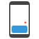

# impression



[![Build Status][travis-image]][travis-url]
[![NPM Version][npm-version-image]][npm-url]
[![NPM Downloads][npm-downloads-image]][npm-url]
[![MIT License][license-image]][license-url]
[![Codecov][codecov-image]][codecov-url]
[![Codacy Badge][codacy-image]][codacy-url]

Element [impression](https://en.wikipedia.org/wiki/Impression_(online_media)), for ads or user behaviour statistics.

Written in es6 javascript, published as npm package as es5 along with a browser standalone.

## Browser support

IE9+, chrome, safari, firefox, opera...

## Installation

### npm

`npm install @vivaxy/impression`

### browser

`<script src="./bundle/impression.rollup.js"></script>`

`<script src="./bundle/impression.webpack.js"></script>`

## Usage

```js
import Impression from '@vivaxy/impression';
const impression = new Impression();
const element = document.querySelector('#test');
impression.isViewable(element); // => true
impression.on('begin', '#test', (element) => {
    console.log(`element shown into view`, element);
});
impression.on('end', '#test', (element) => {
    console.log(`element shown out of view`, element);
});
impression.scan(); // flush current viewable element
```

## API

### *constructor* `Impression` => `{Impression}`

Initialize the instance.

`const impression = new Impression(options)`

### `isViewable` => `{Boolean}`

Test if an element is viewable.

`impression.isViewable(element)`

Only accepts a single element.

### `on` => `{Impression}`

Listen when elements match selector enter or leave the view.

`impression.on(event, selector, callback)`

`callback(element, { type, direction })`

### `off` => `{Impression}`

Remove listeners.

`impression.off(event, selector, callback)`

`impression.off(event, selector)`

`impression.off(event)`

`impression.off()`

### `scan` => `{Impression}`

Scan page to update element status.

`impression.scan()`

### `once` => `{Impression}`

`impression.once(event, selector, callback)`

### `attach` => `{Impression}`

`impression.attach()`

### `detach` => `{Impression}`

`impression.detach()`

### `onObservers` => `{Impression}`

`impression.onObservers(type, callback)`

### `onceObservers` => `{Impression}`

`impression.onceObservers(type, callback)`

### `offObservers` => `{Impression}`

`impression.offObservers(type, callback)`

`impression.offObservers(type)`

`impression.offObservers()`

## Options

### tolerance

The number of pixels an element is allowed to enter its container boundaries before calling its callback.

default `0`

### debounce

The number of milliseconds to wait before calling an element's callback after the changes.
 
default `100`

### container

The container of the elements you want to track.
 
default `window`

## Events

### begin

```js
impression.on('begin', '[data-impression-uniqueid="1"]', (element, { type }) => {
    // => which element begins to impression
    // => the cause of the change
});
```

### end

```js
impression.on('end', '[data-impression-uniqueid="1"]', (element, { type }) => {
    // => which element's impression ends
    // => the cause of the change
});
```

## Types

- mutation
- resize
- scroll
- unload
- scan

## Reference

- [onScreen](https://github.com/silvestreh/onScreen)
- [判断元素是否在屏幕中出现](https://vivaxyblog.github.io/2016/08/17/is-element-on-screen.html)
- [Code Coverage of Mocha Tests using Istanbul and Karma](https://ariya.io/2013/12/code-coverage-of-mocha-tests-using-istanbul-and-karma)
- [babel-plugin-istanbul](https://github.com/istanbuljs/babel-plugin-istanbul)
- [Chai Assertion Library BDD](http://chaijs.com/api/bdd/)
- [in-view.js](https://github.com/camwiegert/in-view)

[travis-image]: https://img.shields.io/travis/vivaxy/impression.svg?style=flat-square
[travis-url]: https://travis-ci.org/vivaxy/impression
[npm-version-image]: http://img.shields.io/npm/v/@vivaxy/impression.svg?style=flat-square
[npm-url]: https://www.npmjs.com/package/@vivaxy/impression
[npm-downloads-image]: https://img.shields.io/npm/dt/@vivaxy/impression.svg?style=flat-square
[license-image]: https://img.shields.io/npm/l/@vivaxy/impression.svg?style=flat-square
[license-url]: LICENSE
[codecov-image]: https://img.shields.io/codecov/c/github/vivaxy/impression.svg?style=flat-square
[codecov-url]: https://codecov.io/gh/vivaxy/impression
[codacy-image]: https://api.codacy.com/project/badge/Grade/d7b573db992a43acae3c7ef06c2cd312
[codacy-url]: https://www.codacy.com/app/vivaxy2012/impression?utm_source=github.com&amp;utm_medium=referral&amp;utm_content=vivaxy/impression&amp;utm_campaign=Badge_Grade
